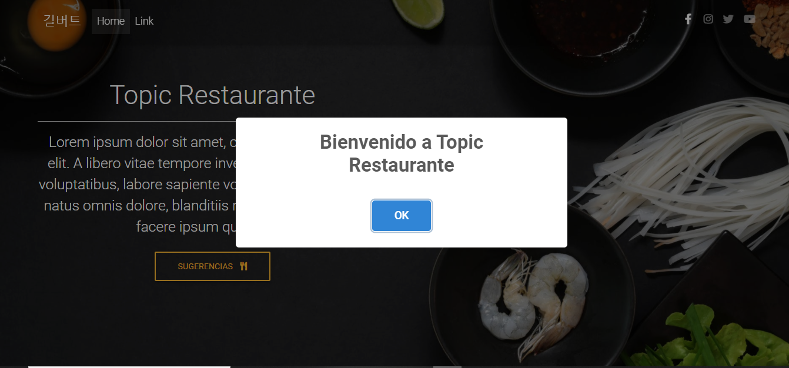
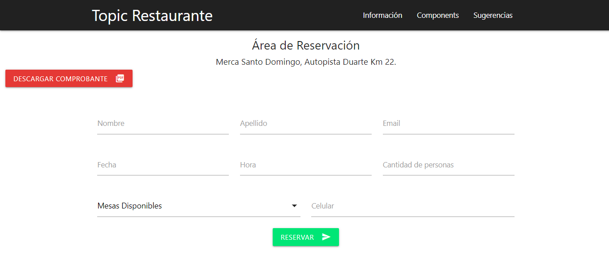
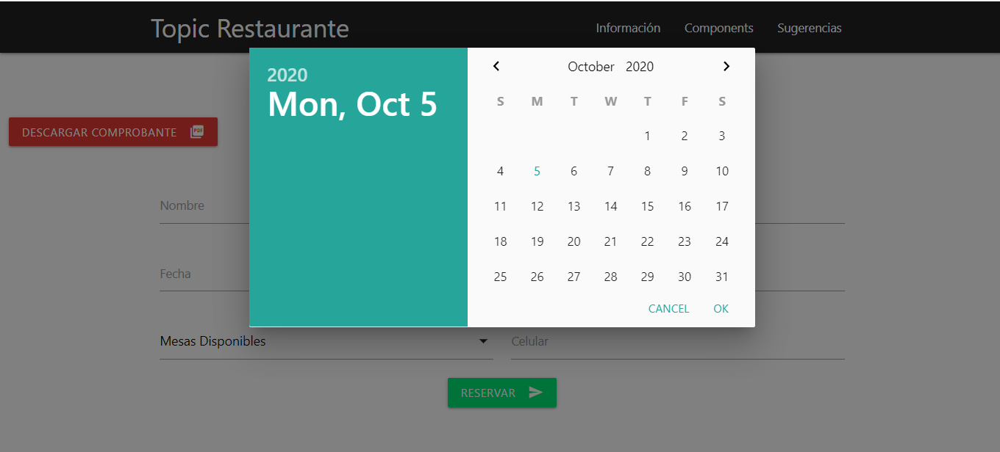
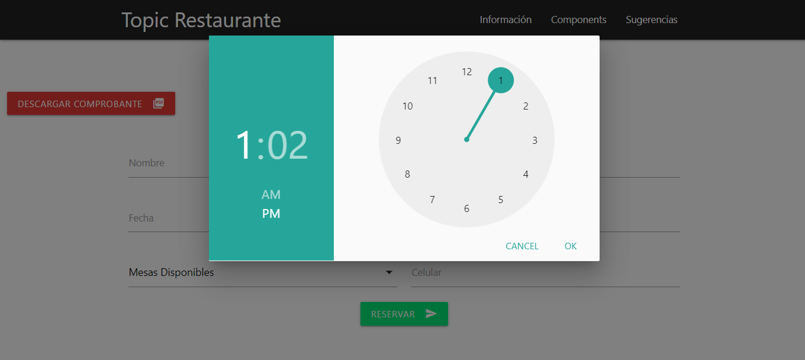
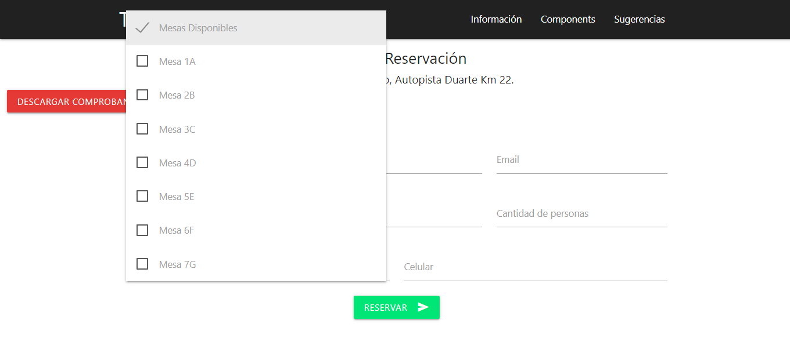
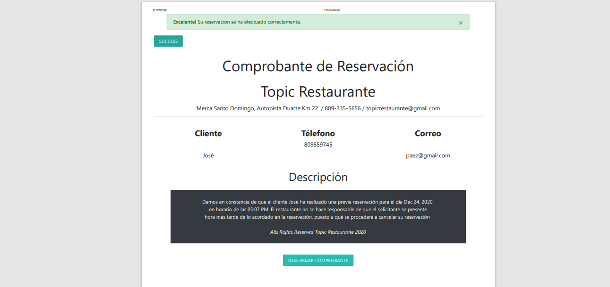

# Área de Reservación (Restaurante)

Este proyecto consiste en una Página web de un restaurante, el cual contiene un apartado para que el cliente pueda realizar una reservación en dicho restaurante, en donde el cliente suministrará sus datos personales, correo electrónico, fecha, hora, y una mesa en específica. Antes de poder realizar todo este proceso el cliente deberá de estar registrado en la página y acceder atravéz de un usuario creado por el mismo, en caso de no poseer una cuenta, la página le proporcionará una formulario de registro. 

## Tecnologías Utilizadas

- Laravel
- PHP
- BootsTrap
- Materialize

